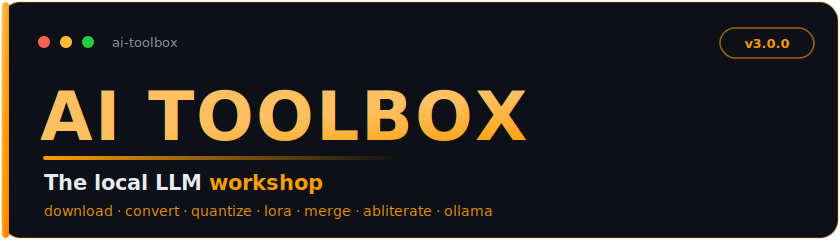

<div align="center">



**Paikallinen LLM-verstas** — lataa, muunna, kouluta, yhdistä ja abliteroi paikallisia LLM-malleja.

*Suomenkielinen opas · [English README](README.md)*

</div>

---

## Uutta versiossa 3.0

- **Mergekit Wizard** - Ammattimainen mallien yhdistäminen (SLERP, DARE-TIES, DARE-LINEAR, TIES, DELLA)
- **Abliteration** - Poista kieltäytymiskäytös malleista
- **Model Hub** - Parannettu kirjasto lajittelulla ja siivouksella
- **Ollama Manager** - Luo ja hallitse Ollama-malleja
- **Training Center** - Kaikki koulutus, datasetit, merget ja abliterointi yhdessä
- **Kaunis CLI** - Yhtenäiset tyylit, tekniset termit englanniksi, kuvaukset suomeksi

---

## Pääominaisuudet

### Päävalikko (7 vaihtoehtoa)

| Kategoria | Työkalu | Kuvaus |
|-----------|---------|--------|
| **Chat** | Tool Master | Keskustele paikallisten mallien kanssa |
| | Claude Assistant | Claude CLI kehitystyöhön |
| **Mallit** | Model Hub | Lataa, selaa ja hallitse malleja |
| | GGUF Tools | Muunna, kvantisoi ja VRAM-laskuri |
| | Ollama Manager | Luo ja hallitse Ollama-malleja |
| **Edistyneet** | Training Center | LoRA, datasetit, merget ja abliterointi |
| | Benchmark Suite | Suorituskykytestaus ja vertailu |

---

## Pikaopas

### Asennus

```batch
# Ensimmäisellä kerralla
setup.bat

# Käynnistä
toolbox.bat
```

### Navigointi

Käytä nuolinäppäimiä (ylös/alas) ja Enteriä valikoissa.

---

## Model Hub

Keskitetty mallien hallinta:

| Ominaisuus | Kuvaus |
|------------|--------|
| **Download** | Etsi ja lataa HuggingFacesta |
| **Library** | Selaa malleja älykkäällä lajittelulla |
| **Cleanup** | Poista duplikaatit ja puuttuvat |
| **Import** | Lisää paikallisia malleja kirjastoon |
| **Search** | Suodata nimellä, formaatilla tai tageilla |

### Lajitteluvaihtoehdot

- Päivämäärän mukaan (uusimmat ensin)
- Nimen mukaan (aakkosjärjestys)
- Koon mukaan (suurimmat ensin)
- Kvantisoinnin mukaan (Q8 → Q2)
- Formaatin mukaan (GGUF, SafeTensors)

---

## GGUF Tools

Muunna ja optimoi malleja paikallista inferenssiä varten:

| Työkalu | Kuvaus |
|---------|--------|
| **Convert** | HuggingFace → GGUF-muoto |
| **Quantize** | Pienennä mallin kokoa (Q8, Q4, Q2...) |
| **VRAM Calculator** | Arvioi muistivaatimukset |
| **iMatrix** | Importance matrix parempaan Q2-Q4 laatuun |

---

## Training Center

Kaikki koulutus- ja muokkaustyökalut yhdessä:

### LoRA Training

| Ominaisuus | Kuvaus |
|------------|--------|
| **Quick Train** | Pikakoulutus oletusasetuksilla |
| **Advanced Train** | Täysi parametrikontrolli |
| **Test Adapter** | Testaa koulutettu adapteri |
| **Merge Adapter** | Yhdistä adapteri base-malliin |

- Automaattinen Unsloth-kiihdytys (2-5x nopeampi, 50-70% vähemmän VRAM)
- QLoRA-tuki (4-bit/8-bit koulutus)
- Tukee Alpaca-, Chat- ja ShareGPT-formaatteja

### Dataset Tools

| Ominaisuus | Kuvaus |
|------------|--------|
| **Inspect** | Tarkasta datasetin rakenne |
| **Convert** | Muunna formaattien välillä |
| **Clean** | Poista duplikaatit, suodata pituudella |
| **Split** | Jaa train/test/val-osiin |
| **Merge** | Yhdistä useita datasetteja |
| **Token Count** | Laske tokenien määrä |

### Mergekit Wizard

Ammattimainen mallien yhdistäminen optimoidulla VRAM-käytöllä:

| Metodi | Malleja | Kuvaus |
|--------|---------|--------|
| **SLERP** | 2 | Pallomainen interpolointi (suosituin) |
| **DARE-TIES** | 2+ | Edistynyt pruning + TIES (suositeltu) |
| **DARE-LINEAR** | 2+ | Lineaarinen DARE-variantti |
| **TIES** | 2+ | Tehtäväkohtainen interpolointi |
| **DELLA** | 2+ | Tehokas pruning-menetelmä |

**Ominaisuudet:**
- Toimii 10GB VRAM:lla (lazy loading, sharding)
- Automaattinen arkkitehtuuritarkistus
- YAML-konfiguraatioiden tallennus/lataus
- Valmiit presetit
- Automaattinen vocab_size-käsittely

**Presetit:**

| Preset | Metodi | Käyttötarkoitus |
|--------|--------|-----------------|
| `slerp_balanced` | SLERP t=0.5 | Tasapainoinen 2 mallin merge |
| `slerp_light_finetune` | SLERP t=0.3 | Kevyt finetune-paino |
| `dare_ties_language` | DARE-TIES | Kielimallien yhdistäminen |
| `reasoning_r1_style` | SLERP t=0.35 | Reasoning-optimoitu |
| `della_efficient` | DELLA | Pruning + merge |

### Abliteration

Poista kieltäytymiskäytös malleista:

| Ominaisuus | Kuvaus |
|------------|--------|
| **Remove Censorship** | Abliteroi refusal-suunta |
| **Test Model** | Testaa abliteroinnin tulokset |

---

## Ollama Manager

Luo ja hallitse Ollama-malleja GGUF-tiedostoista:

| Ominaisuus | Kuvaus |
|------------|--------|
| **Create Model** | Luo Ollama-malli GGUF:sta |
| **List Models** | Näytä kaikki Ollama-mallit |
| **Delete Model** | Poista Ollama-malli |
| **Run Model** | Käynnistä chat mallin kanssa |

---

## Benchmark Suite

Vertaile mallien suorituskykyä:

| Mittari | Kuvaus |
|---------|--------|
| **Speed** | Tokenit sekunnissa |
| **Memory** | RAM/VRAM-käyttö |
| **Quality** | Vastausten vertailu |
| **Latency** | Aika ensimmäiseen tokeniin |

---

## Asennus

### Vaatimukset

- Python 3.9 tai uudempi
- 8GB+ RAM (mallioperaatioihin)
- NVIDIA GPU suositeltu (koulutus/merget)
- Internet-yhteys (mallien lataukseen)

### Automaattinen asennus

1. Lataa tai kloonaa tämä repositorio
2. **Windows:** aja `toolbox.bat` (tai `setup.bat`) — luo venv:n ja asentaa riippuvuudet ensimmäisellä ajolla
   **Linux/macOS:** aja `./toolbox.sh` — sama, asentuu automaattisesti ensimmäisellä ajolla
3. Siinä kaikki: riippuvuudet asentuvat automaattisesti, ei manuaalisia vaiheita

### Manuaalinen asennus

```bash
# Luo virtuaaliympäristö
python -m venv venv

# Aktivoi (Windows)
venv\Scripts\activate

# Aktivoi (Linux/macOS)
source venv/bin/activate

# Asenna
pip install -e .
```

### Valinnaiset riippuvuudet

```bash
# LoRA-koulutukseen
pip install peft transformers datasets accelerate

# Mergekit-työkaluihin
pip install mergekit

# Abliteraatioon
pip install transformers torch
```

---

## Kvantisointityypit

| Tyyppi | Bitit | Laatu | Käyttö |
|--------|-------|-------|--------|
| F16 | 16 | Paras | Kun laatu on tärkein |
| Q8_0 | 8 | Erinomainen | Hyvä tasapaino |
| Q6_K | 6.5 | Korkea | Laatupainotteinen |
| Q5_K_M | 5.5 | Hyvä | Suositeltu |
| **Q4_K_M** | **4.5** | **Hyvä** | **Suosituin** |
| Q4_K_S | 4.5 | Kohtalainen | Pienemmät tiedostot |
| Q3_K_M | 3.5 | Kohtalainen | Rajallinen RAM |
| Q2_K | 2.5 | Heikko | Äärimmäinen pakkaus |

---

## Muistivaatimukset

### Inferenssi (GGUF)

| Mallin koko | Q4_K_M | Q5_K_M | Q8_0 |
|-------------|--------|--------|------|
| 7B | ~6 GB | ~7 GB | ~9 GB |
| 13B | ~10 GB | ~12 GB | ~16 GB |
| 30B | ~22 GB | ~26 GB | ~35 GB |
| 70B | ~45 GB | ~52 GB | ~75 GB |

### Mergaaminen (Mergekit)

| Mallit | Suositeltu VRAM |
|--------|-----------------|
| 7B x 2 | 10 GB (optimoinneilla) |
| 13B x 2 | 16 GB |
| 30B x 2 | 32 GB |

### Koulutus (LoRA)

| Malli | QLoRA 4-bit | QLoRA 8-bit | Full |
|-------|-------------|-------------|------|
| 7B | ~8 GB | ~12 GB | ~28 GB |
| 13B | ~12 GB | ~20 GB | ~52 GB |

---

## USB-tikkukäyttö

AI Toolbox on suunniteltu kannettavaksi:

1. Kopioi koko `AI Toolbox` -kansio USB-tikulle
2. Kohde-PC:llä aja `toolbox.bat`
3. Riippuvuudet asentuvat automaattisesti

**Vaatimus:** Python 3.9+ asennettuna kohde-PC:llä

---

## Ongelmanratkaisu

### "Python not found"

Asenna Python: https://python.org (muista "Add to PATH")

### "Model not found"

- Tarkista mallin nimi (isot/pienet kirjaimet merkitsevät)
- Aseta `HF_TOKEN` yksityisille malleille

### "Out of memory"

- Käytä pienempää kvantisointia (Q4/Q3)
- VRAM-optimoinnit aktivoituvat automaattisesti (<12GB)
- Käytä QLoRA:a (4-bit) koulutuksessa
- Sulje muut ohjelmat

### "CUDA out of memory" mergessä

Mergekit aktivoi automaattisesti optimoinnit 10GB VRAM:lla:
- `--lazy-unpickle` - Viivästetty lataus
- `--low-cpu-memory` - Välitensorit GPU:lle
- `--out-shard-size 4B` - Pienemmät output-shardit

### Arkkitehtuuri ei täsmää mergessä

Mergekit Wizard tunnistaa automaattisesti yhteensopivuuden:
- Sama arkkitehtuuri vaaditaan
- Eri vocab_size käsitellään automaattisesti

---

## Hakemistorakenne

```
AI Toolbox/
├── src/
│   └── ai_toolbox/
│       ├── cli/                 # CLI-komennot
│       │   ├── app.py           # Pääsovellus
│       │   ├── model_hub_cmd.py # Model Hub
│       │   ├── merger_cmd.py    # Mergekit Wizard
│       │   └── ...
│       ├── core/                # Ydintyökalut
│       ├── models/              # Mallien hallinta
│       ├── conversion/          # GGUF-muunnos
│       ├── training/            # Koulutustyökalut
│       ├── merging/             # Mallien yhdistäminen
│       ├── abliteration/        # Abliteraatio
│       └── integrations/        # Ulkoiset integraatiot
├── tools/                       # Ulkoiset työkalut (llama.cpp)
├── models/                      # Ladatut/muunnetut mallit
├── datasets/                    # Koulutusdatasetit
├── configs/                     # Konfiguraatiotiedostot
├── toolbox.bat                  # Windows-käynnistys
├── README.md                    # Englanninkielinen dokumentaatio
├── LESMINU.md                   # Tämä tiedosto
└── CLAUDE_MCP_SETUP.md          # MCP-asetusohjeet
```

---

**Tehty rakkaudella paikallisen tekoälyn harrastajille**
